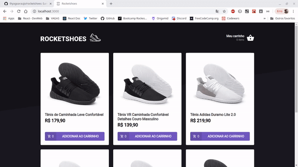
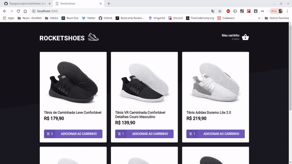

# Rocketshoes

:shoe: NetShoes Clone app with React and Redux

### Demo





## :rocket: Technologies

This project was developed with the following technologies:

- [ReactJS](https://reactjs.org/)
- [Redux](https://redux.js.org/)
- [Redux-Saga](https://redux-saga.js.org/)
- [React Router v4](https://github.com/ReactTraining/react-router)
- [Axios](https://github.com/axios/axios)
- [History](https://www.npmjs.com/package/history)
- [Immer](https://github.com/immerjs/immer)
- [Polished](https://polished.js.org/)
- [React-Toastify](https://fkhadra.github.io/react-toastify/)
- [styled-components](https://www.styled-components.com/)
- [React-Icons](https://react-icons.netlify.com/)
- [react-loading-skeleton](https://github.com/dvtng/react-loading-skeleton)
- [react-loader-spinner](https://github.com/mhnpd/react-loader-spinner)
- [json-server](https://github.com/typicode/json-server)
- [Reactotron](https://infinite.red/reactotron)
- VS Code with EditorConfig and ESLint

## :information_source: How To Use

```bash
# Clone this repository
$ git clone https://github.com/thyagoaraujo/rocketshoes.git

# Go into the repository
$ cd rocketshoes

# Install dependencies
$ yarn install

#Run server
$ json-server server.json -p 3333

# Run the app
$ yarn start
```

## :memo: License

This project is under the MIT license. See the [LICENSE](https://github.com/thyagoaraujo/rocketshoes/blob/master/LICENSE.md) for more information.

---

Made with ♥ by Thyago Araujo :wave: [Get in touch!](https://www.linkedin.com/in/thyagosantosaraujo/)
